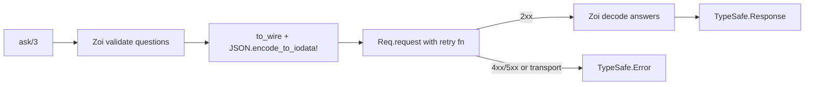

# typesafe — Elixir SDK package spec

Status: draft · Last updated 2026-09-16

## Summary

`typesafe` is a Hex package that gives Elixir apps a typed client for TypeSafe's System One API (the Jev model): build Choice, Noul and Score questions, send them with application state in one request, and get back structs carrying probabilities that your code combines. It should feel complete and idiomatic (it is a community client, not an official TypeSafe SDK): one facade module, plain structs, Req underneath, Zoi schemas for every payload, Telemetry events, and a testing story built on `Req.Test`.

Design principles:

- Code owns the workflow. The SDK returns judgments as data (probabilities, distributions, confidence); thresholds and policy stay in the caller's code, never hidden inside the client.
- Explicit over global. A client is a value you build and pass; application config is a convenience, not a requirement.
- Validate at the edge. Questions are checked with Zoi before a request leaves the process; responses are decoded through schemas into structs with typespecs, so a bad payload fails loudly and locally.
- Composable transport. The client is a `Req.Request`, so users can add steps, swap adapters, and stub with `Req.Test` without the SDK getting in the way.
- Small surface, no magic. No macros required to use it, no process state, no hidden retries beyond what is documented.

Package name proposal: `typesafe` on Hex, top-level module `TypeSafe` (matching the product's own capitalisation). Availability is verified in the Dependencies section.

## API surface the SDK must cover

One endpoint does the work: `POST https://api.typesafe.ai/v1/systemone` takes `state`, `model` and a `questions` map and returns one answer per question id, plus `usage` ([HTTP API reference](https://docs.typesafe.ai/api.md)). A second, `GET /v1/models`, returns `{"models": [{"name", "description", "release_date"}]}`; it is missing from the HTTP reference but both official SDKs call it, per the path constants in [typesafe-sdk 0.6.0](https://pypi.org/project/typesafe-sdk/) and [@typesafe-ai/sdk 0.6.0](https://www.npmjs.com/package/@typesafe-ai/sdk).

| Field | Request | Response |
| --- | --- | --- |
| `state` | string, object or array; the content to judge | not echoed |
| `model` | string, default `jev-latest` | string, model that answered |
| `questions` | map of caller-chosen id to Question; ids are not sent to the model | `answers`: same ids to Answer |
| `usage` | n/a | `input_tokens`, `output_tokens` (integers, may be absent) |

The three question types and their answers ([primitives](https://docs.typesafe.ai/primitives.md)):

| Type | `instructions` | `criteria` | Answer fields |
| --- | --- | --- | --- |
| `noul` | string, object or array | optional `{true, false}` descriptions | `noul` float 0 to 1 |
| `choice` | string, object or array | required map of option to description or `null` | `choice` (top option), `probabilities` map summing to 1, `confidence` 0 to 1 |
| `score` | string, object or array | required ordered array of at least 2 levels | `score` float (may land between levels), `legend` map `"0"`.. to level text, `probabilities` keyed by level string, `confidence` 0 to 1 |

Wire details the package must honour:

- Every `instructions` value, Choice option description, Score level and Noul `true`/`false` entry accepts JSON structure: string, object, array or null ([advanced structure](https://docs.typesafe.ai/primitives/advanced.md)). The SDK must pass Elixir maps and lists through untouched, not stringify them.
- Auth is `Authorization: Bearer <key>`; the response carries `x-typesafe-request-id`, which official SDKs surface on every response and error ([exceptions](https://docs.typesafe.ai/sdk/python/api/exceptions.md)).
- Identification headers both official SDKs send, read from their 0.6.0 sources: `User-Agent: typesafe-sdk/<version>`, `X-TypeSafe-SDK: typesafe-sdk/<version>`, `X-TypeSafe-Runtime: <runtime>/<version> (<platform>; <arch>)`, and `X-TypeSafe-Retry-Count: <n>` on every retried attempt. `Authorization`, `Accept` and these identification headers are protected from user overrides.
- Official defaults ([constants](https://docs.typesafe.ai/sdk/python/api/constants.md)): base URL `https://api.typesafe.ai`, model `jev-latest`, 10 s per HTTP operation, env vars `TYPESAFE_API_KEY`, `TYPESAFE_BASE_URL`, `TYPESAFE_DEFAULT_MODEL`, `TYPESAFE_LOG_LEVEL`. Explicit options beat env vars, which beat defaults; blank env values are ignored.
- Documented errors: 401 (bad key), 422 (validation, body names the offending field), 429 (rate limit), 529 (overloaded). The official SDK taxonomy also maps 400, 403, 404 and other 5xx, and reads `Retry-After` and `retry-after-ms` headers.
- Official retry policy ([retries](https://docs.typesafe.ai/sdk/python/api/retries.md)): 2 retries after the first attempt, backoff 0.5 s doubling to a 5 s cap with 25% jitter, retry on 408, 429 and 500 to 599 plus connection and timeout errors, honour `Retry-After`, and a 30 s total budget per call. The Elixir client matches these numbers so behaviour is consistent across languages.
- Client-side validation the official SDKs perform before sending: at least one question; Score criteria is a list of at least two entries.
- Forward compatibility: the Python SDK skips an answer whose `type` it does not know, logs a warning and leaves the raw body reachable, instead of failing the whole response. The Elixir client does the same.

## Dependencies

Three runtime deps (req, zoi, telemetry) and the standard library's `JSON`; everything else is dev or test only. Versions below were read from the hex.pm API on 2026-09-16, and `typesafe`, `typesafe_ai` and `typesafe_sdk` were all unregistered on Hex that day, so the package can take the plain name `typesafe`.

| Package | Latest on Hex (date) | mix.exs requirement | Scope | Why |
| --- | --- | --- | --- | --- |
| [req](https://hex.pm/packages/req) | 0.7.4 (2026-08-26); 0.8.0-rc.0 (2026-08-18) | `~> 0.7.4 or ~> 0.8` | runtime | HTTP client with Finch pools, retries with jitter and `Retry-After` handling, `Req.Test` stubs, JSON decoding, auth redaction in logs |
| [zoi](https://hex.pm/packages/zoi) | 0.18.7 (2026-07-23) | `~> 0.18` | runtime | Schemas for questions, answers, errors and client options; `Zoi.type_spec/1` for `@type`s, `Zoi.describe/1` for option docs, `Zoi.to_json_schema/1` for published wire schemas, `Zoi.struct/3` and `Zoi.discriminated_union/3` for answer decoding |
| [telemetry](https://hex.pm/packages/telemetry) | 1.4.2 (2026-05-11) | `~> 1.4` | runtime | Start/stop/exception events per request; the ecosystem standard, already pulled in by Req/Finch |
| Elixir `JSON` | stdlib since 1.18 | `elixir: "~> 1.18"` | runtime | Encoding request bodies and decoding responses without a JSON dep; Req 0.8 drops Jason for the same module |
| [plug](https://hex.pm/packages/plug) | 1.20.3 (2026-07-09) | `~> 1.20` | test | Required by `Req.Plug`, the adapter `Req.Test` runs stubs through |
| [stream_data](https://hex.pm/packages/stream_data) | 1.4.0 (2026-07-14) | `~> 1.4` | test | Property tests for encode/decode round-trips |
| [ex_doc](https://hex.pm/packages/ex_doc) | 0.40.4 (2026-09-03) | `~> 0.40` | dev, runtime: false | HexDocs with guides, grouped modules and cheatsheets |
| [credo](https://hex.pm/packages/credo) | 1.7.19 (2026-06-05) | `~> 1.7` | dev, test | Lint in CI |
| [dialyxir](https://hex.pm/packages/dialyxir) | 1.4.8 (2026-09-05) | `~> 1.4` | dev, test | Dialyzer with PLT caching in CI; typespecs are a selling point of the package |
| [styler](https://hex.pm/packages/styler) | 1.12.2 (2026-07-30) | `~> 1.12` | dev, test | `mix format` plugin so style is enforced, not reviewed |

What Req 0.7 and 0.8 change for this design ([changelog](https://raw.githubusercontent.com/wojtekmach/req/main/CHANGELOG.md)):

- 0.7.0 replaced the `run_finch`/`put_plug` steps with `Req.Finch` and `Req.Plug` adapter modules, made retry jitter the default, and added `Req.new(req, options)`. 0.6.0 stopped auto-decoding archives (JSON stays on by default) after a security advisory.
- 0.8.0-rc.0 removes the Jason dependency (`json:` now uses `JSON.Encoder`), requires Elixir 1.18+, and moves retry, auth, expect and decode into `Req.Retry`, `Req.Auth`, `Req.Expect` and `Req.Decode`. `Req.Retry` accepts a 2-arity `retry:` function returning `true`, `{:delay, ms}` or `false`, which is exactly what the official retry policy needs.
- Consequence: the SDK encodes bodies itself with `JSON.encode_to_iodata!/1`, converts its structs to plain maps first (no `Jason.Encoder`/`JSON.Encoder` protocol implementations), and relies on Req's default JSON response decoding, so it runs unchanged on 0.7 and 0.8.

Considered and left out: jason 1.4.5 (stdlib `JSON` covers it), nimble_options 1.1.1 (`Zoi.keyword/2` plus `Zoi.describe/1` validates and documents options with no second library), bypass 2.1.0 (last release 2020; `Req.Test` replaces it), mimic 2.4.1 (nothing to mock once the adapter is a plug), tesla and httpoison (Req is the current default for new Elixir HTTP clients).

Toolchain as of 2026-09-16: Elixir 1.20.4 is the latest on [hexdocs](https://hexdocs.pm/elixir/) and OTP 29.1 on [erlang.org](https://www.erlang.org/downloads). Minimum supported: Elixir 1.18 on OTP 27, the floor Req 0.8 sets and the first pair with stdlib `JSON`.

## Package layout and public API

The whole SDK is reachable from `TypeSafe`: build a client, build questions, call `ask/3`, read structs. Everything else is a supporting module a user can ignore until they need it.

| Module | Responsibility |
| --- | --- |
| `TypeSafe` | Facade: `new/1`, `ask/3`, `ask!/3`, `list_models/2`, question constructors `noul/2`, `choice/3`, `score/3` |
| `TypeSafe.Client` | Struct wrapping a `Req.Request` plus resolved options (`api_key`, `base_url`, `model`, `timeout`, `retry`, `headers`, `finch`); `new/1`, `request/2` |
| `TypeSafe.Question` and `TypeSafe.Question.{Noul, Choice, Score}` | Question structs, Zoi schemas, `to_wire/1` |
| `TypeSafe.Answer` and `TypeSafe.Answer.{Noul, Choice, Score}` | Answer structs, Zoi schemas, `from_wire/1`, helpers such as `Choice.ranked/1` and `Score.expected_level/1` |
| `TypeSafe.Response` | `%{model, answers, usage, request_id, raw}`; `nouls/1`, `choices/1`, `scores/1`, `fetch!/2` |
| `TypeSafe.Usage`, `TypeSafe.Model` | `input_tokens`/`output_tokens`; `name`/`description`/`release_date` |
| `TypeSafe.Retry` | Struct mirroring the official `RetryPolicy` defaults and the function it compiles into Req's `retry:` option |
| `TypeSafe.Error` | Single exception struct; see the Errors section |
| `TypeSafe.Telemetry` | Event names, measurement/metadata docs, `span/3` wrapper |
| `TypeSafe.Test` | Test helpers on top of `Req.Test`: `stub_answers/1`, `stub_error/2`, `stub_transport_error/1` |
| `TypeSafe.Req` | `attach/2`: a Req plugin that registers `:typesafe_*` options, for people who already run their own `Req.Request` |

The main call, in the form the README should open with:

```elixir
client = TypeSafe.new(api_key: System.fetch_env!("TYPESAFE_API_KEY"))

questions = %{
  is_urgent: TypeSafe.noul("Does this convey urgency?",
    criteria: %{true: "Explicitly time-sensitive", false: "No urgency expressed"}),
  department: TypeSafe.choice("Which team should handle this?",
    %{billing: "Payments, invoicing, refunds", technical: "Bugs, outages, integrations", sales: nil}),
  frustration: TypeSafe.score("How frustrated is the customer?",
    ["Calm", "Frustrated", "Very angry"])
}

{:ok, %TypeSafe.Response{answers: answers}} =
  TypeSafe.ask(client, "Help! My payouts have been failing for 3 days.", questions)

answers.is_urgent.noul            # 0.92
answers.department.choice         # "technical"
answers.department.probabilities  # %{"billing" => 0.08, "technical" => 0.85, "sales" => 0.07}
answers.frustration.score         # 1.6
```

Signatures and rules:

- `TypeSafe.new(opts) :: TypeSafe.Client.t()`. Options are validated with a `Zoi.keyword/2` schema; resolution order is explicit option, then `TYPESAFE_*` env var, then `Application.get_env(:typesafe, key)`, then the default. Empty env values are ignored, matching the official SDKs. A missing API key raises `ArgumentError` at `new/1`, never at request time.
- `TypeSafe.ask(client, state, questions, opts \\ []) :: {:ok, TypeSafe.Response.t()} | {:error, TypeSafe.Error.t()}`. `questions` is a map or keyword list whose keys are atoms or strings; answers come back under the same keys with the same type, because the API echoes ids verbatim. Per-call `opts`: `model`, `timeout`, `retry`, `headers`, `telemetry_metadata`. `ask!/4` unwraps or raises.
- `state` is passed through as given: a binary stays a JSON string, a map or list is encoded as JSON structure. The SDK never serialises a map into a string for the caller.
- Question constructors accept `instructions` and `criteria` as strings, maps or lists, since every one of those wire fields takes JSON structure. `choice/3` accepts criteria as a map (option to description or `nil`) or a plain list of options, which becomes a map of `nil` descriptions. Atom options are sent as strings and mapped back on the way in: `choice` and the keys of `probabilities` come back as whatever the caller used, atoms or strings, the same round trip the SDK does for question ids.
- `TypeSafe.list_models(client, opts \\ []) :: {:ok, [TypeSafe.Model.t()]} | {:error, TypeSafe.Error.t()}` calls `GET /v1/models`.
- `TypeSafe.Response.fetch!(response, :department)` raises a clear `KeyError` naming the missing id, and `nouls/1`, `choices/1`, `scores/1` return maps filtered by answer type, mirroring the Python SDK's grouped properties.
- Every public function has a `@spec`; struct `@type t`s are generated from the Zoi schemas with `Zoi.type_spec/1` so the specs and the runtime validation cannot drift.

Repository layout: `lib/typesafe.ex`, `lib/typesafe/{client,question,answer,response,retry,error,telemetry,test,req}.ex` with `question/` and `answer/` subfolders for the three primitives, `guides/` for ex_doc (getting started, questions, confidence, testing, telemetry), `test/` mirroring `lib/`, and `priv/json_schema/` with the schemas emitted by `Zoi.to_json_schema/1` for contract tests against the API reference.

## Question and answer types (Zoi)

Each primitive is one struct with one Zoi schema that does three jobs: validate what the caller built, generate the `@type t`, and decode what the API returns. The same schema also emits the JSON Schema kept in `priv/` for contract tests.

Question side, sketched for Score (Noul and Choice follow the same shape):

```elixir
defmodule TypeSafe.Question.Score do
  @entry Zoi.union([Zoi.string(), Zoi.map(Zoi.any(), Zoi.any()), Zoi.array(Zoi.any()), Zoi.null()])

  @schema Zoi.struct(__MODULE__, %{
    instructions: @entry,
    criteria: Zoi.array(@entry) |> Zoi.min(2, error: "score criteria needs at least two levels")
  })

  @type t :: unquote(Zoi.type_spec(@schema))
  defstruct [:instructions, :criteria]

  def schema, do: @schema
  def new(instructions, criteria), do: Zoi.parse(@schema, %__MODULE__{instructions: instructions, criteria: criteria})
  def to_wire(%__MODULE__{} = q), do: %{"type" => "score", "instructions" => q.instructions, "criteria" => q.criteria}
end
```

Rules for the question schemas:

- `@entry` is the wire's `EntryType` (string, object, array or null). Nested maps and lists pass through untouched so structured instructions, taxonomy subtrees and level objects work exactly as in the docs.
- Noul: `instructions` required, `criteria` optional `%{true: entry, false: entry}`; accept atom or string keys and emit the string keys `"true"`/`"false"`.
- Choice: `criteria` is `Zoi.map(Zoi.string() |> Zoi.min(1), @entry)` after normalising atom keys to strings; at least one option; duplicate options after string conversion are an error.
- Score: at least two levels, mirroring the check the official SDKs make before sending.
- The request envelope has its own schema: `%{state: Zoi.union([...]), model: Zoi.string(), questions: Zoi.map(Zoi.string(), question_union)}` with a `min(1)` on questions. `question_union` is `Zoi.discriminated_union("type", [noul, choice, score])`.
- Validation errors from `Zoi.parse/2` are wrapped in `TypeSafe.Error` with `type: :invalid_request` and the Zoi error list attached, so callers get `path` and `code` for each problem instead of a string.

Answer side, decoded with `Zoi.map(..., coerce: true)` to turn the API's string keys into atom struct fields, then `Zoi.to_struct/2`:

| Answer | Fields (type) | Helpers |
| --- | --- | --- |
| `TypeSafe.Answer.Noul` | `noul :: float` in 0..1 | `yes?/2` with a caller-supplied threshold, default 0.5 |
| `TypeSafe.Answer.Choice` | `choice :: option`, `probabilities :: %{option => float}`, `confidence :: float`, where `option` is the caller's own key type | `ranked/1` (list of `{option, p}` descending), `margin/1` (top minus second) |
| `TypeSafe.Answer.Score` | `score :: float`, `legend :: %{non_neg_integer => entry}`, `probabilities :: %{non_neg_integer => float}`, `confidence :: float` | `expected_level/1` (rounded index plus legend text), `max_level/1`, `ranked/1` |

Decoding rules:

- Answers are decoded by the wire `type`. Known types go through their Zoi schema, and a field with the wrong shape fails with `TypeSafe.Error{type: :invalid_response, path: ["answers", "tone", "confidence"]}`, the Python SDK's `field_path`. An unknown type is skipped with a `Logger.warning/1` and stays readable in `response.raw`, matching the Python SDK's forward-compatibility rule.
- Keys round-trip: question ids and Choice options are looked up in the request that produced the response, so `answers.department.choice` is `:technical` when the caller passed atoms and `"technical"` when they passed strings.
- Score `legend` and `probabilities` arrive keyed by strings such as `"0"`; the schema coerces them to integers with `Zoi.integer() |> Zoi.coerce()` as the map key type, so users index with `probs[2]`, not `probs["2"]`.
- Probabilities are floats; ranges are enforced with `Zoi.gte(0)` and `Zoi.lte(1)`, and the response schema tolerates extra fields (`unrecognized_keys: :strip`) so a new API field never breaks an old client.
- `usage` fields are optional integers, since the official SDK documents them as possibly absent.

## Client and transport (Req)

`TypeSafe.new/1` builds one immutable `Req.Request` and stores it in the client struct; every `ask/3` runs `Req.request/1` on a copy, so clients are safe to share across processes and need no GenServer or application supervision.



Validation and encoding happen before the network and decoding after it, in plain functions rather than Req response steps, because Req 0.8 deprecates response and error steps.

How the client is assembled:

```elixir
Req.new(
  base_url: base_url,                          # default https://api.typesafe.ai
  auth: {:bearer, api_key},                    # redacted by Req in logs and inspect
  headers: [
    {"user-agent", "typesafe-elixir/0.1.0"},   # official SDKs' format, own name: this is not an official SDK
    {"x-typesafe-sdk", "typesafe-elixir/0.1.0"},
    {"x-typesafe-runtime", "elixir/1.20.4 (otp/29; linux; x86_64)"}
  ],
  receive_timeout: timeout,                    # default 10_000 ms, the official per-operation timeout
  connect_options: [timeout: timeout],
  retry: &TypeSafe.Retry.decide(policy, &1, &2),
  retry_delay: &TypeSafe.Retry.delay(policy, &1),
  max_retries: policy.max_retries,             # default 2
  retry_log_level: :debug,
  finch: finch_opts                            # optional [name: MyApp.TypeSafeFinch]
)
|> Req.Request.prepend_request_steps(typesafe_retry_count: &TypeSafe.Client.put_retry_count/1)
|> Req.merge(user_req_options)                 # config :typesafe, req_options: [...] wins last
```

Identification: the three headers use the shape both official SDKs send (an SDK identifier twice, plus a runtime string in their `<runtime>/<version> (<platform>; <arch>)` shape), but identify this package as `typesafe-elixir/<version>` rather than the official `typesafe-sdk/<version>`, since it is not an official SDK, and `x-typesafe-retry-count` is added by a request step that reads Req's `:req_retry_count` private on every attempt after the first. Transport: api.typesafe.ai negotiated HTTP/2 over ALPN on 2026-09-16, but the client keeps Req's default HTTP/1 Finch pool, whose per-connection timeouts and retries are the well-trodden path; the telemetry guide shows the one-line `finch: [name: ...]` configuration for teams that want an `:http2` pool at high concurrency.

Retry policy, as a `TypeSafe.Retry` struct with the official defaults: `max_retries: 2`, `backoff_initial_ms: 500`, `backoff_max_ms: 5_000`, `jitter: 0.25`, `statuses: [408, 429 | 500..599]` (so 529 Overloaded is covered), `respect_retry_after: true`, `retry_transport_errors: true`, `budget_ms: 30_000`. `decide/3` returns `{:delay, ms}` when a `retry-after-ms` or `Retry-After` header is present, `true` for a retryable status or `%Req.TransportError{}`, and `false` otherwise; it also returns `false` once `System.monotonic_time` minus the start stamp stored in `request.private[:typesafe_started_at]` would cross the budget, which is how the 30 s cap is enforced without a second timer. Req's built-in `:safe_transient` mode only retries GET and HEAD, so the function form is required for this POST endpoint; the evaluation call has no side effects, which is what makes retrying it safe. Users can pass `retry: false` or a `%TypeSafe.Retry{}` per client or per call.

Options and configuration (`TypeSafe.new/1` and `config :typesafe`), resolved in the order explicit option, env var, application config, default:

| Option | Env var | Default |
| --- | --- | --- |
| `api_key` | `TYPESAFE_API_KEY` | none; missing key raises `ArgumentError` |
| `base_url` | `TYPESAFE_BASE_URL` | `https://api.typesafe.ai` |
| `model` | `TYPESAFE_DEFAULT_MODEL` | `jev-latest` |
| `timeout` | none | `10_000` ms |
| `retry` | none | `%TypeSafe.Retry{}` defaults above |
| `headers` | none | `[]`; `authorization`, `accept`, `user-agent`, `x-typesafe-sdk`, `x-typesafe-runtime` and `x-typesafe-retry-count` cannot be overridden, matching the official SDKs |
| `finch` | none | Req's default HTTP/1 pool |
| `req_options` | none | `[]`; merged last, which is where `plug: {Req.Test, TypeSafe}` goes in `config/test.exs` |

`TYPESAFE_LOG_LEVEL` is intentionally not mirrored: Elixir apps configure `Logger` and Req's `retry_log_level` instead. `retry_log_level` defaults to `:debug` because the official SDKs log each retry at info under a default `warn` threshold, so retries are silent by default there too; the `retries` count on the Telemetry stop event is the intended signal.

Telemetry, emitted with `:telemetry.span/3` around the whole call including retries:

| Event | Measurements | Metadata |
| --- | --- | --- |
| `[:typesafe, :request, :start]` | `system_time`, `monotonic_time` | `model`, `question_count`, `question_ids`, `base_url`, user `telemetry_metadata` |
| `[:typesafe, :request, :stop]` | `duration`, `input_tokens`, `output_tokens` | above plus `status`, `request_id`, `retries` |
| `[:typesafe, :request, :exception]` | `duration` | above plus `kind`, `reason`, `stacktrace` |

Req and Finch already emit per-attempt events (`[:req, :request, ...]`, `[:finch, ...]`), so the SDK documents its events as per-call and does not duplicate the per-attempt ones.

Concurrency guidance for the guides: prefer one request carrying many questions (the docs measure batching a 13-question job as 12.2x cheaper and 10x faster than separate calls) and use `Task.async_stream/3` with `max_concurrency` when the same questions run over many states, keeping the client struct shared and the Finch pool sized to match.

## Errors

One exception struct, `TypeSafe.Error`, with a `type` atom to pattern-match on; Elixir code matches on tuples and fields, so a class hierarchy like the Python SDK's adds nothing here.

```elixir
%TypeSafe.Error{
  type: :rate_limited,        # see table
  message: "rate limit exceeded",
  status: 429,                # nil for transport, timeout and invalid_request
  body: %{...} | binary | nil,
  headers: %{...},
  request_id: "req_...",      # x-typesafe-request-id when present
  endpoint: "POST https://api.typesafe.ai/v1/systemone",
  retry_after_ms: 1200,       # rate_limited and overloaded only
  path: ["answers", "tone", "confidence"],   # invalid_response and invalid_request
  details: [%Zoi.Error{}],    # invalid_request
  reason: :timeout            # transport and timeout; the Req/Finch reason
}
```

| `type` | Trigger | Retried by default |
| --- | --- | --- |
| `:invalid_request` | Zoi validation failed before sending (no questions, one Score level, bad option key) | no |
| `:bad_request` | HTTP 400 | no |
| `:authentication` | HTTP 401 | no |
| `:permission_denied` | HTTP 403 | no |
| `:not_found` | HTTP 404 | no |
| `:unprocessable` | HTTP 422; `body` carries the server's field details | no |
| `:rate_limited` | HTTP 429 | yes |
| `:overloaded` | HTTP 529 | yes |
| `:server` | any other 5xx | yes |
| `:api` | any other non-2xx | no |
| `:transport` | `%Req.TransportError{}` such as `:econnrefused` or `:closed` | yes |
| `:timeout` | `%Req.TransportError{reason: :timeout}` | yes |
| `:invalid_response` | 2xx whose body failed the Zoi response schema | no |

Behaviour:

- `ask/3` returns `{:error, %TypeSafe.Error{}}`; `ask!/3` raises the same struct, and `Exception.message/1` renders type, status, request id and the first Zoi issue in one line so logs are useful without inspecting the struct.
- The 422 body is kept verbatim in `body`; the SDK does not try to parse the server's field naming, because the API reference only promises that the body names the offending field.
- Errors surfaced after retries report the final attempt; the `retries` count goes to Telemetry metadata, not the struct.
- Zoi's own errors never leak as raw lists: they are wrapped once at the boundary, which keeps the public API to a single error type.
- `TypeSafe.Error.retryable?/1` exposes the same predicate the retry policy uses, for callers who implement their own escalation, such as sending an uncertain or failed case to a reasoning model.

## Testing strategy

All tests run without the network and `async: true`, because the only seam is Req's adapter: `plug: {Req.Test, TypeSafe}` swaps the HTTP layer for a plug stub owned by the test process.

The package's own tests, mirrored under `test/`:

| Layer | What is covered | How |
| --- | --- | --- |
| Question schemas | Valid and invalid constructors for each primitive, atom/string key normalisation, structured `instructions` and `criteria` passthrough | ExUnit with the JSON examples from the API reference as fixtures |
| Wire encoding | `to_wire/1` output equals the documented request JSON byte-for-byte after `JSON.encode!` | Fixture files in `test/fixtures/requests/` copied from the docs |
| Answer decoding | Every documented response decodes into the right struct; string level keys become integers; unknown fields are ignored; malformed fields give `:invalid_response` with a path | Fixtures in `test/fixtures/responses/` |
| Round trips | Random questions encode and re-parse through their own schema; random answer maps decode and re-encode to equal maps | `stream_data` generators built from the Zoi schemas |
| Client | Auth header, user agent, base URL and model resolution order (option, env, config, default), protected headers | `Req.Test.stub/2` asserting on `conn` |
| Retries | 429 then 200 succeeds with a `Retry-After` delay; 529 retried; 401 not retried; budget stops a fourth attempt; `retry: false` disables | `Req.Test.expect/3` with ordered plugs and `retry_delay` set to a zero function to keep the suite fast |
| Errors | Each status maps to its `type`; transport errors via `Req.Test.transport_error/2`; request id captured | `Req.Test.stub/2` |
| Telemetry | Start/stop/exception fire once per call with the documented metadata | `:telemetry_test.attach_event_handlers/2` |
| Contract | `Zoi.to_json_schema/1` output for request and response schemas matches the checked-in `priv/json_schema/*.json`, so a schema change is a visible diff | Snapshot comparison |

`TypeSafe.Test`, shipped for users of the package (it depends on `plug`, so it is compiled only when `Plug` is available):

```elixir
# config/test.exs
config :typesafe, req_options: [plug: {Req.Test, TypeSafe}]

# in a test
TypeSafe.Test.stub_answers(%{
  department: {:choice, :technical, %{billing: 0.08, technical: 0.85, sales: 0.07}, 0.82},
  is_urgent: {:noul, 0.92},
  frustration: {:score, 1.6, ["Calm", "Frustrated", "Very angry"], %{0 => 0.05, 1 => 0.3, 2 => 0.65}, 0.78}
})

assert {:ok, %TypeSafe.Response{answers: %{department: %{choice: :technical}}}} =
         MyApp.Router.route(ticket)
```

- `stub_answers/1` builds a well-formed response body. `confidence` is the last tuple element and optional: when omitted the helper uses the top probability as a placeholder, because TypeSafe does not publish its derivation (the [confidence](https://docs.typesafe.ai/confidence.md) page says only that it is computed from the distribution), so any test that thresholds on confidence sets it explicitly. The helper also asserts that the stubbed question ids match the ids the app actually sent, so a renamed question fails the test instead of silently returning nothing.
- `stub_error/2` takes a status and optional body and headers (`retry_after_ms:` sets both headers); `stub_transport_error/1` wraps `Req.Test.transport_error/2`.
- Stubs use the same ownership model as Mox, so `Req.Test.allow/3` covers Tasks and GenServers, and the guide shows the Broadway pattern from Req's docs.

A live smoke test (`mix test --only live`) hits `POST /v1/systemone` and `models.list` with a real key from `TYPESAFE_API_KEY`, records the responses under `test/fixtures/live/`, and is excluded by default and from CI on forks.

## Docs, quality and release

The package ships at 0.1.0 with full HexDocs, a green CI matrix across three Elixir/OTP pairs, and a checklist that makes `mix hex.publish` a one-line step.

mix.exs essentials:

```elixir
def project do
  [
    app: :typesafe,
    version: "0.1.0",
    elixir: "~> 1.18",
    name: "TypeSafe",
    source_url: "https://github.com/mattneel/typesafe",
    homepage_url: "https://github.com/mattneel/typesafe",
    description: "Elixir client for the TypeSafe System One API (Jev): typed Choice, Noul and Score judgments for your code.",
    package: [licenses: ["MIT"], links: %{"GitHub" => "https://github.com/mattneel/typesafe", "TypeSafe API docs" => "https://docs.typesafe.ai"}, files: ~w(lib priv guides mix.exs README.md CHANGELOG.md LICENSE)],
    docs: [main: "readme", extras: ~w(README.md CHANGELOG.md guides/getting-started.md guides/questions.md guides/confidence.md guides/testing.md guides/telemetry.md),
           groups_for_modules: [Questions: ~r/Question/, Answers: ~r/Answer/, Transport: [TypeSafe.Client, TypeSafe.Retry, TypeSafe.Req], Testing: [TypeSafe.Test]]],
    dialyzer: [plt_add_apps: [:ex_unit, :plug], plt_local_path: "priv/plts"]
  ]
end
```

Documentation rules:

- Every public function has a doctest-style example that runs against `Req.Test`, so the docs cannot go stale silently.
- Option docs for `TypeSafe.new/1` and `TypeSafe.Retry` are generated from the Zoi schemas with `Zoi.describe/1` and interpolated into `@moduledoc`, one source of truth for validation and prose.
- Guides map one-to-one to the TypeSafe docs concepts: state, questions and structure, confidence and thresholds, batching many questions in one call, testing, telemetry. Each links to the corresponding page on docs.typesafe.ai rather than restating it.
- A `cheatsheets/typesafe.cheatmd` gives the three constructors, `ask/3`, answer fields and the error types on one page.

CI (GitHub Actions) on every push and PR:

| Job | Matrix or tool |
| --- | --- |
| Test | Elixir 1.18 / OTP 27, 1.19 / OTP 28, 1.20 / OTP 29; `mix test --warnings-as-errors`, coverage with `mix test --cover` |
| Req compatibility | Same suite once with `req ~> 0.7.4` locked and once with `0.8.0-rc.0`, until 0.8 is stable |
| Static | `mix format --check-formatted` (styler plugin), `mix credo --strict`, `mix dialyzer` with a cached PLT, `mix docs --warnings-as-errors`, `mix hex.audit`, `mix deps.unlock --check-unused` |
| Live | `mix test --only live` on a schedule with a repo secret; never on forks |

Versioning and publishing:

- SemVer with 0.x until the API reference stops changing shape; any wire-level change to answers is at least a minor bump and a CHANGELOG entry in Keep a Changelog format.
- The user agent embeds the package version from `Mix.Project.config()[:version]` at compile time so support can tell SDK versions apart from server logs.
- Release checklist, kept in `RELEASING.md`: bump version and CHANGELOG, `mix hex.build` and inspect the tarball, `mix docs` and open locally, tag `v0.1.0`, `mix hex.publish`, then publish docs. Give `typesafe` at least two Hex owners (`mix hex.owner add`), or move it to a Hex organisation the maintainer controls, so the package is never single-maintainer.
- Deprecations go through `IO.warn/2` with a `since:` note and stay for at least one minor version.

## Roadmap and decisions

0.1.0 is the core above; the items below are ordered by how much they add for Elixir users specifically.

1. `TypeSafe.Req.attach/2` plugin so teams with an existing `Req.Request` (shared pools, tracing steps) add `typesafe_state:` and `typesafe_questions:` options instead of a second client. Ships once Req 0.8 is stable, since its step model changed.
2. `TypeSafe.Batch`: a helper that takes many states and one question set, runs `Task.async_stream/3` with a concurrency limit and per-item error tuples, and returns results in input order. Covers the re-ranking and classification cookbooks without users hand-rolling supervision.
3. Livebook and Kino smart cell: paste state, edit questions, see probabilities as a bar chart. Cheap because the structs are plain data.
4. A `mix typesafe.schema` task that writes the request and response JSON Schemas from the Zoi definitions, for teams that validate payloads elsewhere.
5. Phoenix and Broadway guides showing `Req.Test.allow/3` for stubs in spawned processes, drawn from Req's own documentation.
